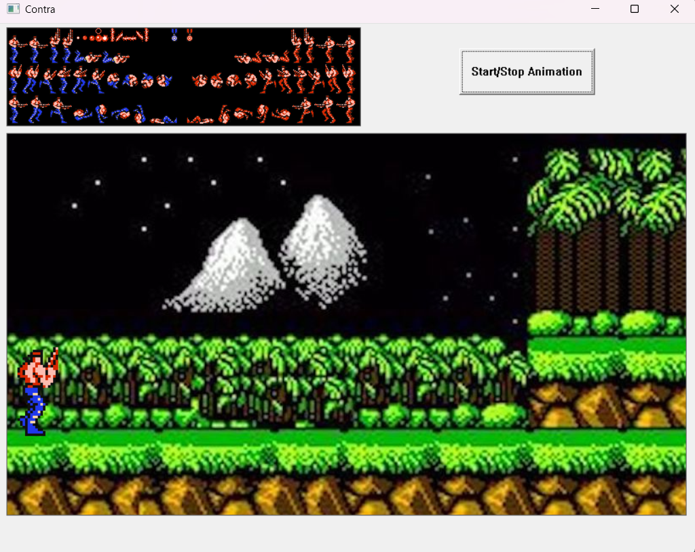
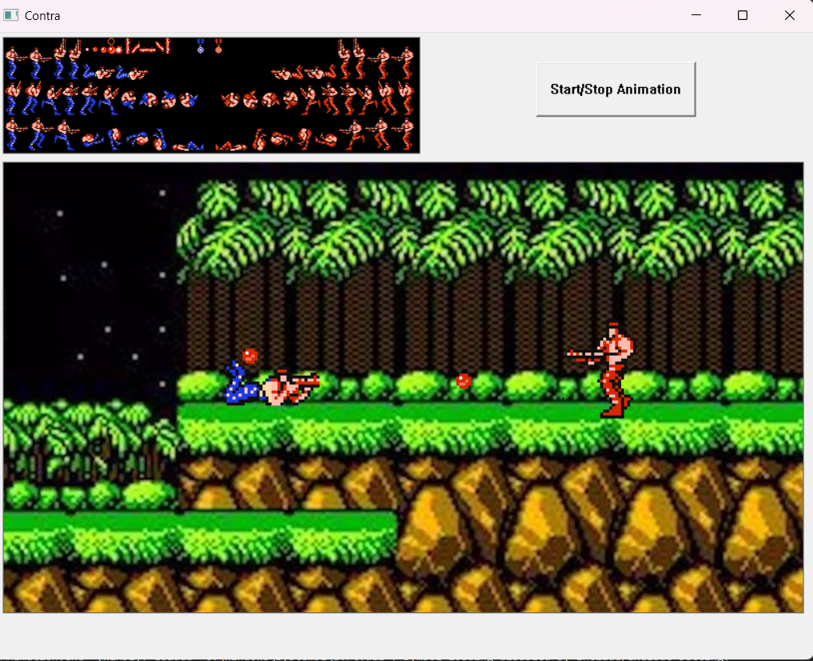
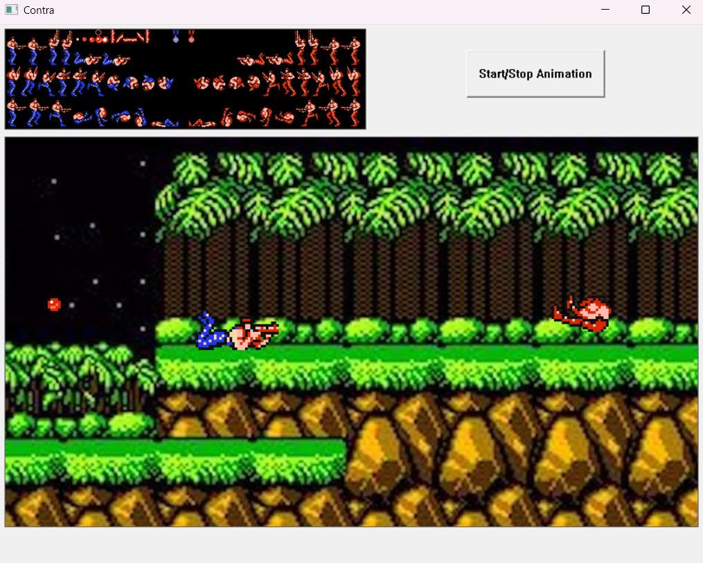

# Contra Animation

A C++ animation project inspired by Contra Game (1987), utilizing the **ICBYTES** graphics library. The animation includes sprites, sound effects, and various character actions.

## Features

- 🎮 **Contra-style Animation**
- 🎼 **Sound Effects & Music**
- 🔄 **Endless Animation Loop**
- 🖼 **Intro Scene** included
- 🛠 **Thread-based Animation Control**

## Installation & Setup

1. Clone the repository:
   ```bash
   git clone https://github.com/ErenKaradeniz0/Contra-Animation.git
   cd Contra-Animation

2. Install the **ICbytes** library if it's not already installed:
   - Visit [ICbytes official documentation](https://otoidrak.com/doc/I-See-Bytes%20A%20Simplified%20C++%20Library.pdf) for installation instructions.
   - Visit [ICbytes Main Page](https://otoidrak.com/Yazilim.html)
   
## Images




## Contributors

👤 **Eren Karadeniz** - [GitHub](https://github.com/ErenKaradeniz0)  
👤 **Ulas Deniz Cakmazel** - [GitHub](https://github.com/UlasDenizCakmazel)  
👤 **Sevval Gur** - [GitHub](https://github.com/svvlgr)  

## License

📜 This project is licensed under the MIT License.
